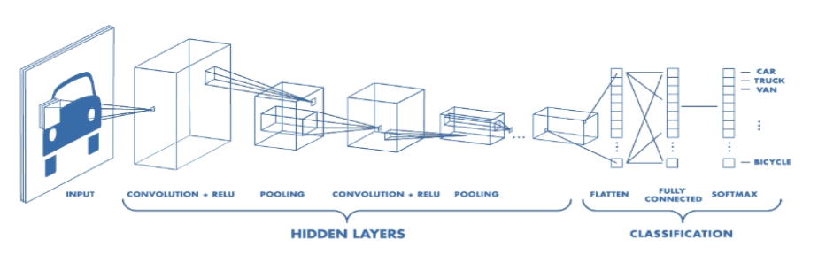
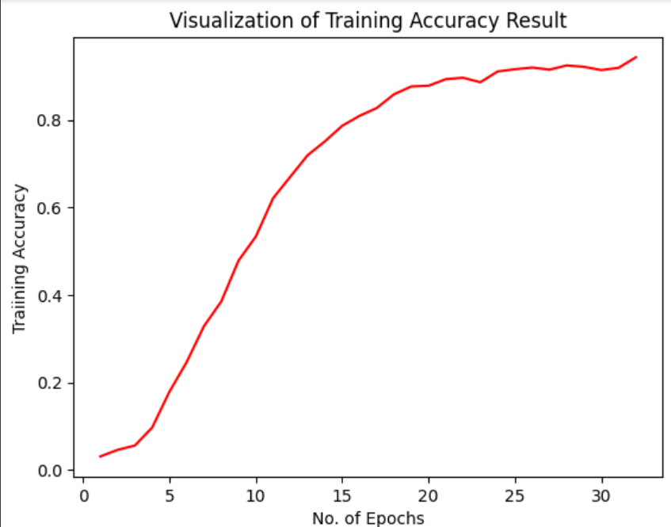
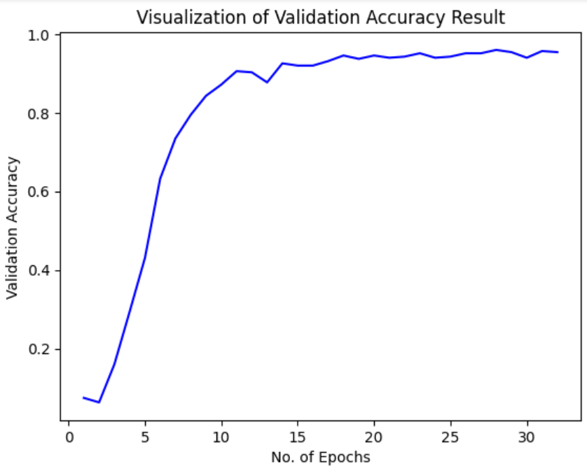

# 🍱 Food Classification and Calorie Estimation using Deep Learning

This project focuses on classifying food items from images and estimating their calorie content using computer vision and deep learning techniques. It aims to help users track nutritional intake through image-based food recognition.



## 🚀 Features

- 🍔 Food image classification using CNN
- 🔍 Food segmentation for isolating food items
- 🎨 Feature extraction using color, shape, and texture descriptors
- 📊 Calorie estimation using food density and volume
- 🧠 Machine learning and deep learning models integrated
- 📈 Performance evaluation and metrics tracking

## 🧰 Technologies Used

- Python 3.10.10
- TensorFlow / Keras
- OpenCV
- NumPy, Pandas
- Scikit-learn
- Matplotlib / Seaborn


## 📊 Dataset

The dataset includes images of various food items, each annotated with ground truth labels for class and calories. Density values are also included for accurate calorie computation.

If you're using a public dataset, mention it here, e.g.:

> Dataset: [Food-101](https://www.kaggle.com/datasets/kritikseth/fruit-and-vegetable-image-recognition)
## 📊 Training & Validation Results

Here are the accuracy and loss curves for the training and validation phases of the model:

### 🔹 Training Accuracy Curve


### 🔹 Validation Accuracy Curve


These plots help visualize how well the model is learning over time. A narrowing gap between training and validation curves typically indicates good generalization. Significant divergence may suggest overfitting.

> 📁 Make sure your `accuracy_curve.png` and `loss_curve.png` are saved in the `/assets` directory.


## 🔍 How it Works

1. **Preprocessing**: Food images are segmented using contour detection and thresholding.
2. **Feature Extraction**: Extracts color (HSV histogram), texture (Gabor filters), and shape (Hu Moments) features.
3. **Classification**: Classifies food using a trained CNN or ML model.
4. **Volume Estimation**: Estimates the portion size from the image.
5. **Calorie Calculation**: Calculates total calories using:
Calories = Volume × Density × Caloric Value per Gram


## 🛠️ How to Run

1. Clone the repository:
```bash
git clone https://github.com/lakshay0nsut/Food_recognition_and_calorie_estimation.git
cd food-calorie-estimation

Install dependencies:
pip install -r requirements.txt

📈 Sample Results
Image	Predicted Class	Estimated Calories
🍕 pizza.jpg	Pizza	266 kcal
🍎 apple.jpg	Apple	95 kcal
Add images or plots to visualize results.

🤖 Model Performance
Metric	Value
Accuracy	92.3%
Precision	91.8%
Recall	92.5%
F1-Score	92.1%
📌 Future Work
Improve segmentation accuracy using semantic segmentation (e.g., U-Net).

Integrate with mobile app for real-time predictions.

Expand dataset for more diverse food items.

🙌 Contributing
Contributions are welcome! Please open an issue first to discuss what you would like to change.

📄 License
This project is licensed under the MIT License. See the LICENSE file for details.

🙋‍♂️ Contact
Created by Lakshay and Divyanshu — feel free to connect!

css
Want me to generate a `requirements.txt` or a sample banner image to go along with it?
